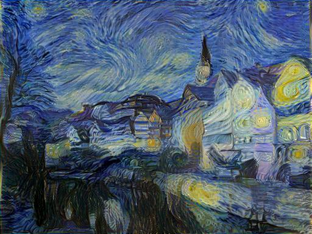
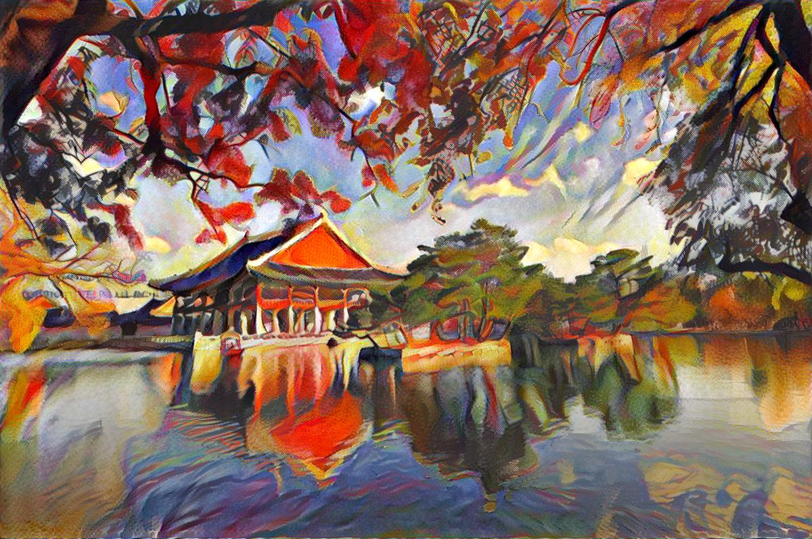
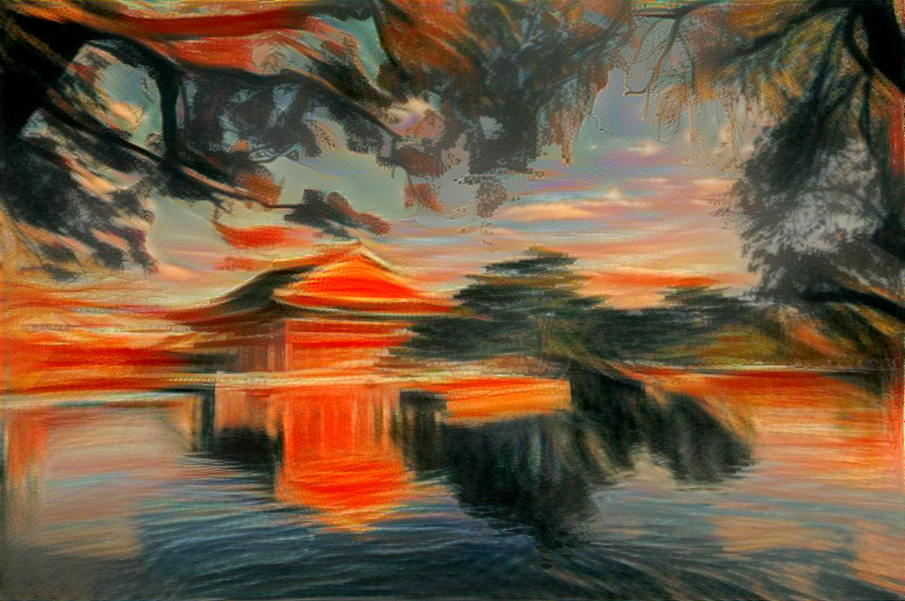

# Neural-Style-Transfer

Neural Style Transfer is a technique that allows us to **combine the content of one image with the style of another image**. It uses deep neural networks to extract the content and style features from the input images and then applies them to generate a new image that preserves the content of the original image while adopting the artistic style of the reference image. In this project, we will explore an implementation of Neural Style Transfer.

## How the Algorithm Works

**Load and Preprocess Images**:

- The content and style images are loaded and preprocessed to be compatible with a deep learning model. This usually involves resizing the images and normalizing their pixel values.

**Feature Extraction with a Pre-trained Model (VGG19)**:

- A pre-trained convolutional neural network, such as VGG19, is used to extract features from the content and style images. VGG19 is particularly good at capturing high-level features due to its deep architecture.
- The model is used to obtain feature representations of the content and style images at different layers.

**Define Loss Functions**:

- **Content Loss**: Measures the difference in content between the generated image and the content image. This ensures that the generated image retains the structure and objects of the content image.
- **Style Loss**: Measures the difference in style between the generated image and the style image. This is typically done by comparing the Gram matrices of the feature maps, which capture the correlations between different features.
- **Total Variation Loss**: (Optional) Encourages spatial smoothness in the generated image by penalizing large differences between adjacent pixel values.

**Initialize the Generated Image**:

- The generated image is usually initialized as a copy of the content image or as random noise.

**Optimization**:

- The goal is to iteratively update the generated image to minimize the combined loss function (content loss + style loss + total variation loss).
- Optimization algorithms like **L-BFGS** or **BFGS** are used to find the pixel values of the generated image that minimize the loss function. These algorithms are effective for this type of optimization because they are well-suited for problems with many variables and can converge quickly.

**Iterative Refinement**:

- The optimization process involves many iterations. In each iteration, the generated image is updated to reduce the loss function.

**Post-process and Save the Final Image**:

- After the optimization process, the generated image is post-processed to convert it back to a standard image format (e.g., RGB) and to ensure pixel values are within a valid range.
- The final stylized image is then saved to disk.

## Some Results

| Content Image | Style Image | Result |
|:----------------:|:--------------:|:--------:|
|  |  |  |
|  |  |  |
|  |  |  |

## Potential Improvements

- The process can start with a low-resolution image and progressively increase the resolution, refining the details at each step. This technique can help in achieving better quality results and faster convergence.
